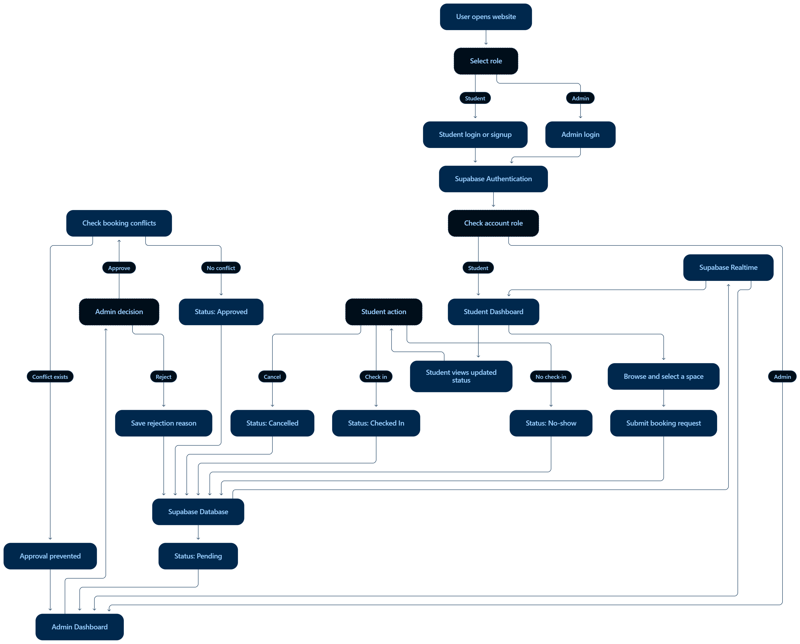

# Empty Room — KUET Campus Space Management

> Built by KUET_Underdogs for ForkedArch Freshers Hackathon 2026.

## 🌐 Live Website

[Visit Empty Room](https://empty-room-iota.vercel.app)

## 👥 Team

| Name | Roll | Department | GitHub |
| --- | --- | --- | --- |
| Nazmus Sadat | 2507024 | CSE | [@NazmusSadat0](https://github.com/NazmusSadat0) |
| Adil Mahmud Ayon | 2507103 | CSE | [@adilmahmudayon-hue](https://github.com/adilmahmudayon-hue) |
| Mitaly Farzana | 2507091 | CSE | [@mitalyoyshe](https://github.com/mitalyoyshe) |
| Antora Ghosh | 2507097 | CSE | [@agantoraghosh-prog](https://github.com/agantoraghosh-prog) |

---

## ❔ Problem

### Problem Statement

**The Empty Room**

A classroom is empty for three hours every afternoon. Somewhere else, a group of students is desperately looking for a place to work. A laboratory is available, but nobody knows whether they are allowed to use it. A meeting room has been reserved but nobody actually shows up.

There is space everywhere—but somehow, nobody can find it when they need it.

What an absolute mess!
KUET needs this problem to be solutioned soon.

Maybe a digital solution for this that will be able to solve this?
The system could deal with classrooms, study spaces, meeting rooms, labs, sports facilities, community spaces, or even resources outside a campus.
Probably a system where you can know the availability, booking, conflicts, cancellations, usage, permissions, and fairness.

Brainstorming twist: Don't assume that "available" simply means "empty." What makes a space genuinely usable?

### 🤔 KUET_Underdogs' Understanding

Finding a place to work should not be harder than the work itself. But a group of students might spend time asking around for a room while another classroom sits empty nearby. Even after finding one, they may not know whether they are allowed to use it, where to collect the key or whether another group has already booked it.

We understood that students need clear room information and a shared booking process. These are the main problems we identified:

1. **Finding a space:** Students do not have one place to check which rooms they could use.
2. **Knowing the available time:** A room might be free now, but needed for a class shortly afterwards.
3. **Understanding permissions:** An empty lab does not necessarily mean anyone can use it. Some spaces need approval or supervision.
4. **Requesting a booking:** Students have to ask around or visit an office instead of following a clear process.
5. **Avoiding conflicting bookings:** Different groups may request the same room for overlapping times.
6. **Dealing with no-shows:** A reservation can block others even when the group never arrives.
7. **Sharing cancellations:** When someone cancels, other students may not know that the slot has opened up.
8. **Checking facilities:** Students need to know whether a room has enough seats and the equipment their activity requires.
9. **Getting access:** A booking is not very useful if students do not know how to enter the room or whom to contact.
10. **Keeping access fair:** A few users could repeatedly book popular spaces. We identified this concern but kept advanced fairness controls outside our current scope.
11. **Keeping records:** Without a shared booking history, it is difficult for the admin to track requests, decisions and cancellations.

For us, a usable space is more than an empty room. It needs to be suitable for the activity, available for the required time and accessible to the students requesting it.

---

## 💡 Our Solution

### Overview

We built Empty Room to make finding and booking a space at KUET less confusing. Instead of asking around or visiting the department office, students can check room facilities, send a booking request and follow its status from one place.

The system covers classrooms, study spaces, meeting rooms, laboratories and sports facilities. It shows capacity, equipment and any listed access requirements to help students choose a suitable space.

The admin reviews requests and manages room information. Booking conflicts are also checked at the database level, so an overlapping reservation cannot be approved just because someone missed it while reviewing the schedule.

### How It Works

1. Students create an account and log in. Their dashboard shows their pending, upcoming and cancelled bookings, along with booking history.

2. Students visit the Facilities page to compare spaces. On the booking page, they choose a room, date, start time, end time, purpose and participant count.

3. After submission, the student returns to the dashboard. The request appears as pending, and the admin receives it in the Requests section.

4. The admin reviews the request and checks the Booked Rooms schedule. Date and time filters help identify reservations that overlap the requested period.

5. The admin approves the request or rejects it with a selected reason. The database prevents approval if the same space already has an overlapping approved or checked-in booking.

6. The student’s dashboard updates to show the decision. Rejected bookings include the admin’s reason.

7. Students can cancel a pending or approved booking before it starts. Cancelling an approved booking releases its reserved time.

8. The admin uses the schedule and history pages to review reservations and closed requests.

---

## ✨ Features

### For Students

- **Account creation and login:** Students sign up with their name, roll, email and password.
- **Personal booking dashboard:** View booking totals, pending requests, upcoming reservations and cancellations.
- **Facilities directory:** Browse room descriptions, locations, capacities, projectors and listed equipment.
- **Room requirements:** View usage rules, permission information and access instructions where provided.
- **Booking requests:** Select a space, date, time, purpose and participant count.
- **Booking status updates:** Follow a request from submission to the admin’s decision.
- **Rejection explanations:** See why the admin rejected a request.
- **Cancellation:** Cancel eligible requests before the booking starts.
- **Booking activity filters:** Switch between all, pending, upcoming, cancelled and history records.

### For the Admin

- **Dedicated admin access:** Admin pages are restricted to the designated administrator.
- **Request review:** See the student, room, purpose, participant count and requested time.
- **Approval and rejection:** Approve requests or reject them with a reason.
- **Booked Rooms schedule:** View approved and checked-in reservations.
- **Schedule search:** Search by room, student, roll, location or purpose.
- **Date and status filters:** Narrow the schedule to a particular day or booking status.
- **Time-window filtering:** Find bookings that overlap a selected start and end time.
- **Space management:** Add and manage room records through the admin interface.
- **Booking history:** Review completed, rejected, cancelled, no-show and expired records, with date and status filters and pagination.

### Shared System Features

- **Database conflict prevention:** Overlapping approved or checked-in bookings for the same space are blocked.
- **Booking validation:** The backend checks booking times, opening hours, participant capacity and whether a space accepts bookings.
- **Access control:** Database policies restrict students to their own booking records while allowing the admin to review requests.
- **Realtime booking updates:** Booking changes refresh the relevant dashboards while their subscriptions are connected.
- **Responsive layouts:** Pages are styled for desktop and mobile screens.

History displays the statuses stored in the database. Automatic transitions to completed, expired or no-show are not implemented yet.

---

## 🛠️ Technology Stack

### Frontend Development

| Technology | Role in our project |
| --- | --- |
| **React** | Builds the interface using reusable components for navigation, form inputs, dashboards and room information. |
| **JavaScript** | Handles form input, filtering, date/time formatting, API requests and user interactions. |
| **HTML and JSX** | Structure the pages, forms, navigation, cards and information sections. |
| **CSS** | Styles the interface, including layouts, status labels, filters and responsive designs. |
| **React Router** | Connects pages and organizes student and admin routes under their respective layouts. |
| **React Hooks** | Manage component state, fetch data, subscribe to booking changes and calculate filtered results. |

### Backend and Database

| Technology | Role in our project |
| --- | --- |
| **Supabase** | Provides the hosted database, authentication, data API and Realtime services used by the React application. |
| **PostgreSQL** | Stores the application’s profiles, spaces and bookings in related tables. |
| **`@supabase/supabase-js`** | Connects the React frontend to Supabase for authentication, database queries, booking actions and subscriptions. |
| **Supabase SQL Editor** | Used to configure the database schema, functions, triggers, constraints and access policies. |
| **Row Level Security (RLS)** | Controls which records a signed-in user can read or change. |
| **PostgreSQL functions and triggers** | Handle profile creation, booking validation and permitted booking-status changes. |
| **PostgreSQL exclusion constraint** | Prevents overlapping approved or checked-in bookings for the same space. |

### Authentication, Realtime and SMTP

| Technology | Role in our project |
| --- | --- |
| **Supabase Auth** | Handles student signup, email/password login and user sessions. |
| **Supabase Realtime** | Listens for booking changes and triggers dashboard refreshes. |
| **Resend SMTP** | Configured as Supabase Auth’s custom SMTP server to deliver authentication emails. Resend is not directly integrated into the React app. |

### Development and Debugging

| Tool | Role in our project |
| --- | --- |
| **Vite** | Runs the frontend development server and builds the production website. |
| **npm** | Installs dependencies and runs development, build and lint commands. |
| **VS Code** | Used to write and organize the project files. |
| **Chrome DevTools** | Used to inspect layouts, browser errors and network requests. |
| **Oxlint** | Provides the project’s configured JavaScript linting command. |

### Collaboration and Deployment

| Tool | Role in our project |
| --- | --- |
| **Git** | Tracks code changes and maintains version history. |
| **GitHub** | Hosts the repository and supports collaboration between team members. |
| **Vercel** | Hosts the deployed frontend and supplies its build-time environment variables. |

### Assistance and Presentation

| Tool | Role in our project |
| --- | --- |
| **Codex** | Assisted with writing, reviewing and debugging code. |
| **ChatGPT** | Assisted with brainstorming, explanations, documentation and presentation preparation. |
| **Microsoft PowerPoint** | Used to prepare the presentation slides. |
| **CapCut** | Used to edit the demonstration video. |
| **Remove.bg** | Used to remove image backgrounds for presentation assets. |

---

## 🗃️ Database Structure

The application uses three main tables:

| Table | What it stores |
| --- | --- |
| `profiles` | User information, including name, roll, email and student/admin role. |
| `spaces` | Room details such as category, location, capacity, equipment, opening hours and operational status. |
| `bookings` | Booking requests, student and space references, dates, times, participants, statuses and rejection reasons. |

Supabase Auth manages login credentials separately. Passwords are not stored in the public `profiles` table.

The recorded database setup is available in:

[`supabase/empty-room-setup.sql`](./supabase/empty-room-setup.sql)

This file contains the exported migration baseline. It is intended for a fresh Supabase project and should not be rerun against the existing working database. It does not include user accounts, booking records, SMTP credentials or any later manual database changes.

---

## 🏗️ Architecture

The React frontend connects to Supabase through the JavaScript client. Supabase Auth handles login, while PostgreSQL policies, functions and constraints enforce access and booking rules. Realtime subscriptions refresh booking information after database changes.

  

**Scope note:** The automatic no-show flow shown in the diagram is planned work. The current implementation does not automatically release missed reservations.

---

## 💻 Running Locally

### 1. Clone the repository

    git clone https://github.com/ForkedArch/Forkathon2026-Team-KUET_Underdogs.git
    cd Forkathon2026-Team-KUET_Underdogs

Use a Node.js version compatible with the Vite version in `package.json`, with npm installed.

### 2. Install dependencies

    npm ci

### 3. Configure Supabase

To connect to an existing configured project, obtain its project URL and publishable key.

To create an independent installation, create a fresh Supabase project and run `supabase/empty-room-setup.sql` in its SQL Editor. The exported baseline has not been independently tested through a full fresh-project installation.

Authentication settings, redirect URLs and custom SMTP must be configured separately.

### 4. Create a local environment file

Create `.env` beside `package.json` and add:

    VITE_SUPABASE_URL=your_supabase_project_url
    VITE_SUPABASE_PUBLISHABLE_KEY=your_supabase_publishable_key

Use the publishable key for the frontend. Do not place a service-role key, database password or SMTP password in these variables.

### 5. Start the development server

    npm run dev

Open the local URL printed in the terminal. Restart the server after changing environment variables.

### 6. Prepare accounts and room information

For a fresh installation:

- Create a student account through the signup page.
- Confirm its email if email confirmation is enabled.
- Assign the designated administrator’s role through trusted database administration.
- Sign in as admin and add space records.

There is no public admin signup option.

### Other commands

| Command | Purpose |
| --- | --- |
| `npm run build` | Build the frontend for production. |
| `npm run preview` | Preview the production build locally. |
| `npm run lint` | Run the configured lint checks. |

---

## 🚧 Current Limitations

We focused on the core booking process for this hackathon. Some parts still need further work:

- **Single-admin workflow:** One designated admin reviews requests. Separate department or facility authorities are not supported yet.
- **Manual room information:** Facilities, opening hours and access instructions depend on the information entered by the admin.
- **No class timetable integration:** Regular classes and other campus schedules are not automatically imported.
- **Booking records do not prove physical occupancy:** The system shows recorded reservations, not whether someone is physically inside a room.
- **No automatic no-show release:** Reservations are not automatically released when students fail to check in.
- **No automatic completion:** Past bookings are not automatically marked as completed or expired.
- **Limited fairness controls:** Booking quotas and limits on repeated reservations are not implemented.
- **No booking email notifications:** Students check booking decisions on their dashboard. Custom SMTP is used for authentication emails.
- **Campus adoption:** This is a hackathon prototype. Official use would require verified room information and agreed access procedures with KUET authorities.

---

**Forkathon: Freshers Hackathon 2026 presented by ForkedArch powered by XtendArena**
